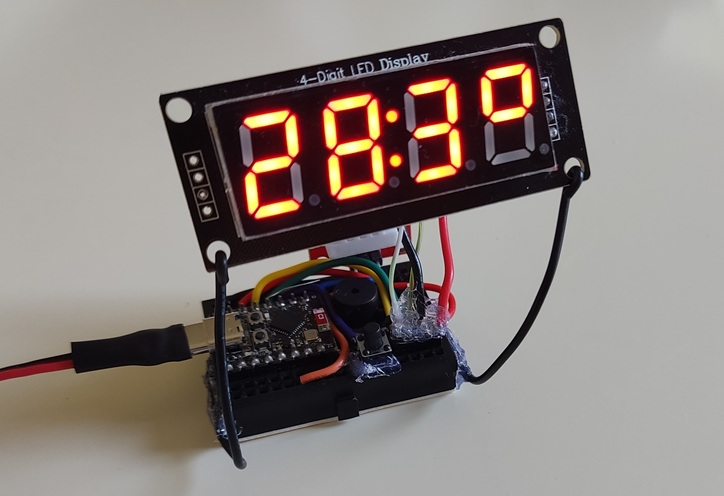

# Dumb Watch

## Components
ESP32-C3 SuperMini, TM1637 display, buzzer, button

## Modes
- Temp/Hum: Display current temperature and humidity (data from DHT22 sensor)
- Timer: countdown from some given time (several hardcoded items - COFFee (1min), EGGS (4min)...)
- Clock: time goes forward; beeps on every 5/10 minutes; format HH:MM; start from 00:00 or displays current time

## TODO
- [ ] Code refactor
   - [x] Use classes for different components
      - [x] timer
   - [ ] add comments to the code
- [x] (bug) Clock: current time is incorrect
- [ ] Make device low power (create new file "main-lp.cpp")
   - Current consumption in different modes (w/o deep sleep) 
      - 41mA w/ display at full brightness (7)
      - 22mA w/ display at normal brightness (1)
      - 18.5mA w/o display (display disconnected)
   - [ ] temp/hum: read less often; sleep between reads
   - [ ] clock: sleep between display updates
   - [ ] ?auto turn off screen
- [ ] Maybe it would be better if 2 or 3 buttons are used instead of 1
- [ ] Maybe it would be better if clicks would work like this:
   - click -> next item (mode, timer item...)
   - long click -> enter/start
   - double click -> exit/back
   - modes would display their names initially: TEHU (temp/hum), TIMR/TIME, CLCK/CLOC, OPT (options)
- [x] Use softer wires between display and BB
- [ ] Make a placeholder for Li-Ion battery
   - for "drone" batteries: metal profile (or couple of solid wires) glued to the bottom of the BB or just hot glue greased drone battery to the bottom of the BB. Make a room for boost converter (5V).
